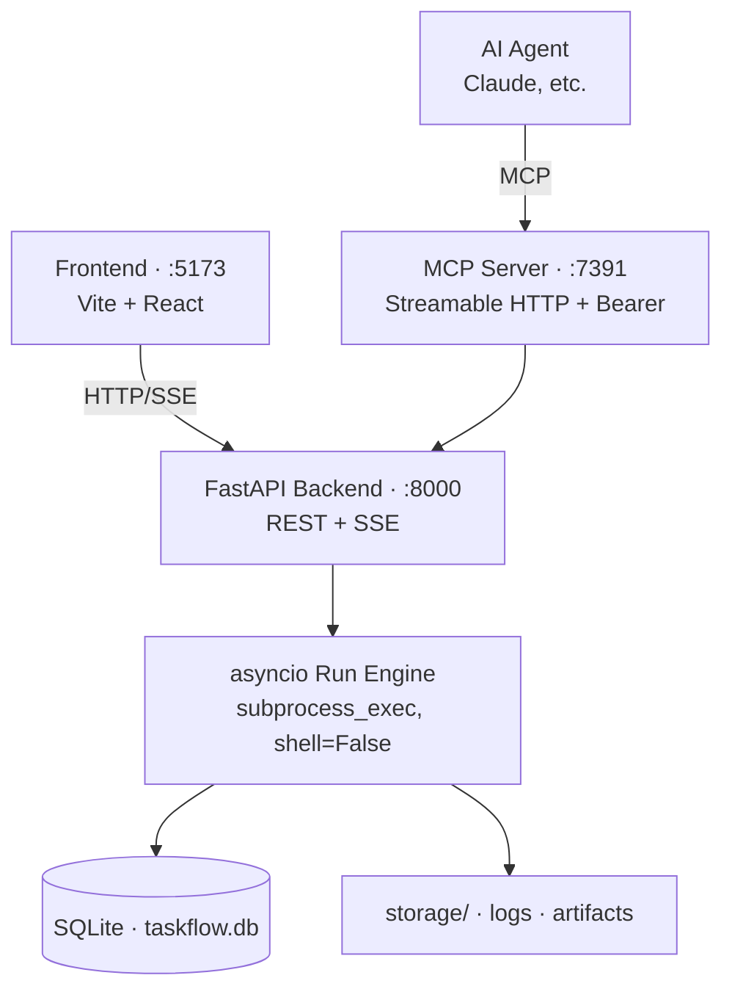

# TaskFlow MCP Server


**A workflow orchestration platform with AI Agents as primary users.** Scope-based permissions, argv allowlist, and hash-chained audit control agent execution, allowing Claude and other agents to safely run jobs through MCP (Model Context Protocol) endpoints.


## Architecture



## Quickstart

```sh
git clone <this-repo> taskflow-mcp-server
cd taskflow-mcp-server
make setup        # venv + npm + DB migrate
make dev          # backend:8000 · mcp:7391 · frontend:5173
```

Open `http://localhost:5173` → `+ New Job` → Run. Starts with an empty DB — create jobs, keys, and artifacts directly through the UI or MCP.

For a detailed tutorial, see [Getting Started](./docs/getting-started.en.md).

Once a run starts, Monitor streams stdout in real time over SSE:


## Key Features

- **AI Agent First** — MCP endpoint lets agents trigger jobs directly; results returned as structured schema (`status`, `steps[]`, `failed_step`, `logs_uri`, etc.)
- **Sandboxed by default** — `shell=False` (argv list only), argv allowlist, fixed cwd, secret env var masking
- **Observable** — Real-time stdout/stderr via SSE, Workflow DAG visualization (DAG · List · Timeline views)
- **Immutable audit** — Append-only hash-chained audit log; integrity verification via `/api/audit/verify`
- **MCP control** — Per-key scopes (`run:<job-id>` / `read:*` / `write:uploads`, etc.) + token bucket rate-limit + full issue/rotate/revoke audit trail

## Documentation

| Document | Contents |
|---|---|
| [Getting Started](./docs/getting-started.en.md) | Installation · First job · argv allowlist |
| [MCP API](./docs/mcp-api.en.md) | Issue key · JSON-RPC calls · Tool list · Claude Desktop |
| [REST API](./docs/rest-api.en.md) | Endpoints · SSE event format · Error codes |
| [Operations](./docs/operations.en.md) | Run modes (A/B/C) · Network binding · Production release · Env vars |
| [Security](./docs/security.en.md) | `shell=False` · allowlist · Secret masking · hash-chained audit |
| [Troubleshooting](./docs/troubleshooting.en.md) | Common symptoms and solutions |
| [Design Docs](./docs/00-overview.md) | Project background · Domain rules · System spec (`00` → `03`) |

## Tests

```sh
make test
```

pytest — 16 test cases:

- `test_audit_chain.py` — 10-event chain intact, 1 row tampering detected
- `test_dag.py` — topo sort, cycle detection, duplicate id/shell string rejection
- `test_allowlist.py` — `echo` allowed, `rm` denied, non-list argv denied
- `test_scope.py` — exact match / wildcard / read-only denies run
- `test_rate_limit.py` — after 10/min burst, 11th call returns `retry_after`

## Out of Scope

Features intentionally excluded from the current sprint:

- Complex RBAC/ABAC UI, multi-workspace / multi-tenant
- Workflow GitOps import/export
- Notification channel configuration (use Step's notify argv instead)
- Distributed worker scheduler (in-process, concurrency 1)
- ClamAV real integration (currently stub — upload immediately READY)
- SIEM forward pipeline (local audit only)
- Real `ROLLBACK` policy (MVP converges to `STOP`)
- PostgreSQL / S3 migration (Alembic path is open)
- `stream` mode for MCP `run_job` (use REST SSE instead)

See [docs/00-overview.md §5.2](./docs/00-overview.md) for rationale.

## Contributing

For dev setup see [Getting Started](./docs/getting-started.en.md); for running tests see the section above. Make sure `make test` passes before submitting a PR.

## License

MIT — see [LICENSE](./LICENSE).
