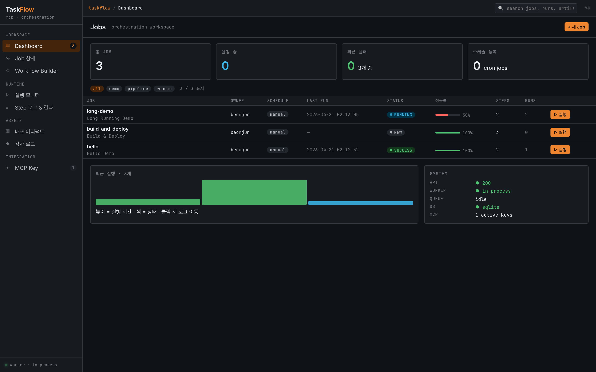
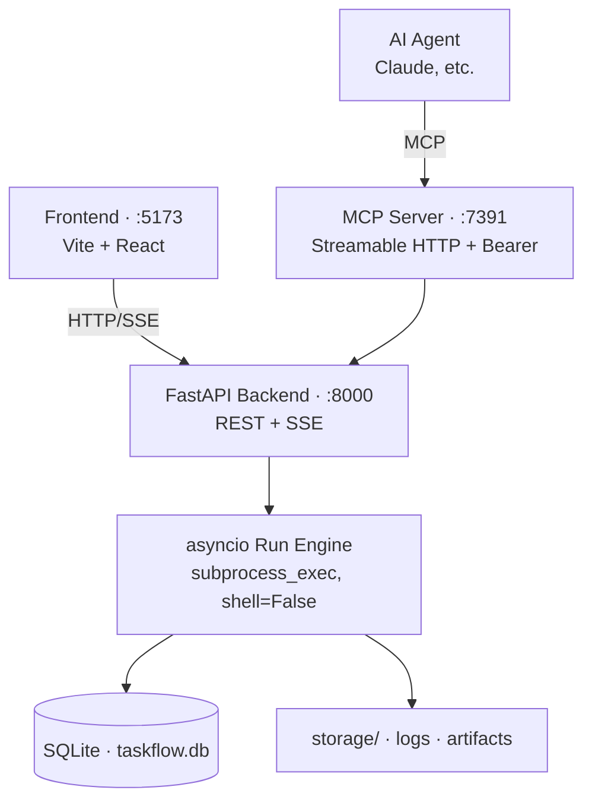
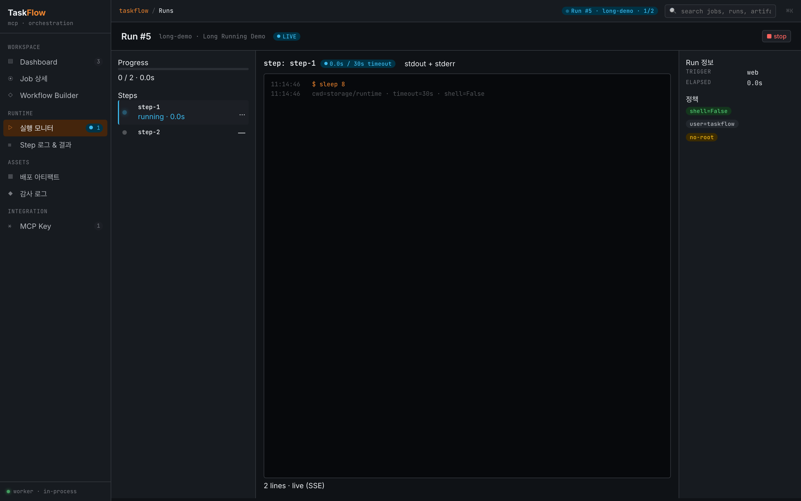

# TaskFlow MCP Server


**AI Agent가 1차 사용자인 Workflow 오케스트레이션 플랫폼.** Scope 기반 권한, argv allowlist, hash-chained audit으로 Agent 실행을 통제하며, MCP(Model Context Protocol) 엔드포인트를 통해 Claude 등 Agent가 Job을 안전하게 실행할 수 있게 합니다.



## Architecture



## Quickstart

```sh
git clone <this-repo> taskflow-mcp-server
cd taskflow-mcp-server
make setup        # venv + npm + DB migrate
make dev          # backend:8000 · mcp:7391 · frontend:5173
```

브라우저로 `http://localhost:5173` 접속 → `+ 새 Job` → 실행. 빈 DB로 시작하므로 UI/MCP로 직접 Job·Key·Artifact를 만들면 됩니다.

자세한 튜토리얼은 [Getting Started](./docs/getting-started.md).

Run을 시작하면 Monitor 화면에서 SSE로 stdout이 실시간 스트림됩니다:



## 주요 특징

- **AI Agent First** — MCP 엔드포인트로 Agent가 Job을 직접 트리거, 결과는 구조화된 스키마(`status`, `steps[]`, `failed_step`, `logs_uri` 등)로 반환
- **Sandboxed by default** — `shell=False`(argv 리스트 전용), argv allowlist, 고정 cwd, 시크릿 환경변수 마스킹
- **Observable** — SSE로 실시간 stdout/stderr 스트림, Workflow DAG 시각화(DAG · List · Timeline 3뷰)
- **Immutable audit** — append-only hash-chained 감사 로그, `/api/audit/verify`로 무결성 검증
- **MCP 통제** — Key별 scope(`run:<job-id>` / `read:*` / `write:uploads` 등) + 토큰 버킷 rate-limit + 발급/회전/revoke 전체 감사 기록

## Documentation

| 문서 | 내용 |
|---|---|
| [Getting Started](./docs/getting-started.md) | 설치 · 첫 Job 만들기 · argv allowlist |
| [MCP API](./docs/mcp-api.md) | Key 발급 · JSON-RPC 호출 · 도구 목록 · Claude Desktop 연동 |
| [REST API](./docs/rest-api.md) | 엔드포인트 · SSE 이벤트 포맷 · 오류 코드 |
| [Operations](./docs/operations.md) | 실행 모드(A/B/C) · 네트워크 바인딩 · 프로덕션 릴리즈 · 환경변수 |
| [Security](./docs/security.md) | `shell=False` · allowlist · 시크릿 마스킹 · hash-chained audit |
| [Troubleshooting](./docs/troubleshooting.md) | 자주 발생하는 증상과 해결 |
| [Design Docs](./docs/00-overview.md) | 프로젝트 배경 · 도메인 규칙 · 시스템 스펙 (`00` → `03` 순서) |

## 테스트

```sh
make test
```

pytest 16개 케이스:

- `test_audit_chain.py` — 10개 이벤트 체인 intact, 1 row 위변조 탐지
- `test_dag.py` — topo sort, 비순환 검증, 중복 id/shell 문자열 거부
- `test_allowlist.py` — `echo` 허용, `rm` 거부, 비-리스트 argv 거부
- `test_scope.py` — 정확 매칭 / wildcard / read-only가 run 거부
- `test_rate_limit.py` — 10/min 버스트 후 11번째 호출 시 `retry_after`

## 범위에서 제외

현재 스프린트 범위 밖으로 의도적으로 제외한 기능:

- 복잡한 RBAC/ABAC UI, multi-workspace / multi-tenant
- Workflow GitOps import/export
- 알림 채널 구성 (Step의 notify argv로 대체)
- 분산 Worker 스케줄러 (in-process, 동시성 1)
- ClamAV 실제 연동 (현재 stub — 업로드 즉시 READY)
- SIEM forward 파이프라인 (로컬 audit만)
- 실 `ROLLBACK` 정책 (MVP는 `STOP`으로 수렴)
- PostgreSQL / S3 전환 (Alembic 경로만 열려있음)
- `stream` 모드의 MCP `run_job` (REST SSE 대체 사용)

자세한 근거는 [docs/00-overview.md §5.2](./docs/00-overview.md).

## Contributing

개발 셋업은 [Getting Started](./docs/getting-started.md), 테스트 실행은 위 섹션 참고. PR 전에 `make test`가 통과하는지 확인해 주세요.

## License

MIT — [LICENSE](./LICENSE) 참조.
