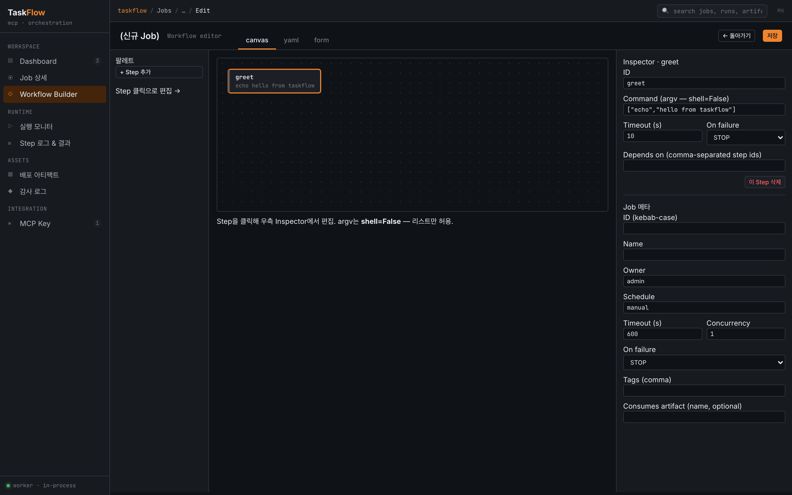

# Getting Started

TaskFlow를 처음 실행하고 UI에서 첫 Job을 만드는 과정을 5분 안에 따라갈 수 있는 가이드입니다.

## 요구사항

- Python 3.11 이상 (3.14에서도 검증됨)
- Node.js 20 이상, npm 10 이상
- macOS · Linux (Windows는 WSL 권장)

## 설치

```sh
git clone <this-repo> taskflow-mcp-server
cd taskflow-mcp-server
cp .env.example .env      # 기본값이 적절하므로 보통 수정 불필요
make setup
```

`make setup`이 수행하는 일:

1. `backend/.venv` 파이썬 가상환경 생성
2. `pip install -e "backend[dev]"` — FastAPI · SQLAlchemy · `mcp` SDK · pytest 등 설치
3. `cd frontend && npm install` — React 등 프론트엔드 의존성 설치
4. `alembic upgrade head` — `backend/taskflow.db` 스키마 생성

빈 DB로 시작합니다. seed 데이터는 투입되지 않습니다.

## 실행

```sh
make dev
```

세 프로세스가 동시에 뜹니다:

| 프로세스 | 포트 | 역할 |
|---|---|---|
| Backend | `http://localhost:8000` | REST API · SSE |
| MCP Server | `http://localhost:7391/mcp` | MCP 엔드포인트 (Bearer 인증) |
| Frontend | `http://localhost:5173` | React UI (API는 Vite 프록시) |

브라우저로 **http://localhost:5173** 접속. 첫 실행 시 Backend가 admin 세션 토큰을 한 번 콘솔에 출력합니다 (향후 UI 인증 활성화용).

> Vite 기본 설정은 `localhost`에만 바인드합니다. 원격 접근이나 LAN 공유가 필요하면 [Operations](./operations.md)의 네트워크 바인딩 섹션을 참조.

## 첫 번째 Job 만들기



1. Dashboard → `+ 새 Job`
2. Builder에서 다음을 입력
   - **ID**: `hello` (kebab-case, 소문자)
   - **Name**: `Hello Demo`
   - **Step 1**: argv = `["echo", "hello from taskflow"]`, timeout = 10
   - **Step 2**: argv = `["sleep", "1"]`, deps = `greet`, timeout = 5
3. `저장` → Dashboard로 이동
4. `hello` 행의 `▷ 실행` 클릭
5. Topbar에 `LIVE` 칩 표시 → Monitor 화면에서 실제 stdout이 SSE로 스트림됨
6. 완료 후 Audit 화면에서 `job.create`, `job.run`, `job.run.done` 이벤트 확인 가능

## argv allowlist

Step의 argv는 로컬 allowlist에 등록된 커맨드만 사용할 수 있습니다. 파일은 **환경별**로 관리하도록 두 개로 분리되어 있습니다:

| 경로 | 추적 | 역할 |
|---|---|---|
| `backend/app/dev/allowlist.example.yaml` | git 추적 | 저장소에 공유되는 기본 템플릿 |
| `backend/app/dev/allowlist.yaml` | **`.gitignore` 제외** | 실제 사용되는 환경별 사본 |

`make setup`(또는 `make setup-backend`) 시 템플릿이 로컬 사본으로 자동 복사됩니다. 이미 사본이 있으면 덮어쓰지 않습니다. 수동으로 재생성하려면 `make bootstrap-allowlist`.

기본 허용 목록:

```yaml
allow:
  - ["echo"]
  - ["printf"]
  - ["sleep"]
  - ["ls"]
  - ["cat"]
  - ["/bin/true"]
  - ["/bin/false"]
  # + /bin/*, /usr/bin/* variants
```

필요한 커맨드(예: `zip`, 또는 환경에 맞는 래퍼 스크립트 절대경로)는 **`allowlist.yaml`**(템플릿이 아닌 로컬 사본)에 추가해야 실행됩니다. 변경 후에는 backend 재시작이 필요합니다(`make stop && make start-bg`). 프로덕션에서는 `TASKFLOW_ALLOWLIST_PATH`로 저장소 밖의 경로(예: `/etc/taskflow/allowlist.yaml`)를 지정할 수 있습니다.

사고 방지를 위한 의도된 제한이며 정책 배경은 [Security](./security.md) 참조.

## Step 작업 디렉토리 (`cwd`)

Step은 기본적으로 `TASKFLOW_STEP_CWD`(`./storage/runtime`)에서 실행됩니다. 특정 디렉토리에서 실행해야 하는 배포 Job은 Step에 `cwd`를 지정하세요.

```json
{
  "id": "deploy",
  "cwd": "/opt/taskflow/apps/api",
  "cmd": ["./deploy.sh"],
  "timeout": 300,
  "deps": []
}
```

`cd /opt/taskflow/apps/api`를 별도 Step으로 두는 방식은 지원하지 않습니다. `cd`는 다음 Step의 작업 디렉토리를 바꾸지 못하므로 `cwd` 필드로 표현합니다.

## 출력 기반 성공/실패 판정

기본 성공 조건은 여전히 `exit_code == 0`입니다. 추가로 stdout/stderr에 특정 문자열이 포함되는지 검사하려면 Step에 `success_contains` 또는 `failure_contains`를 지정하세요.

```json
{
  "id": "health",
  "cmd": ["curl", "-fsS", "http://127.0.0.1:8080/actuator/health"],
  "success_contains": ["UP"],
  "failure_contains": ["DOWN", "Exception"],
  "timeout": 30,
  "deps": ["deploy"]
}
```

`failure_contains` 중 하나라도 출력에 포함되면 Step은 `FAILED`입니다. `success_contains`는 exit 0 이후 모두 포함되어야 하며, 하나라도 누락되면 `FAILED`입니다.

## 다음 단계

- AI Agent에서 호출하려면 → [MCP API](./mcp-api.md)
- REST/SSE로 직접 다루려면 → [REST API](./rest-api.md)
- 프로덕션 배포/네트워크 바인딩 → [Operations](./operations.md)
- 설계 배경/도메인 규칙 → [00-overview.md](./00-overview.md) → [03-system-spec.md](./03-system-spec.md)
