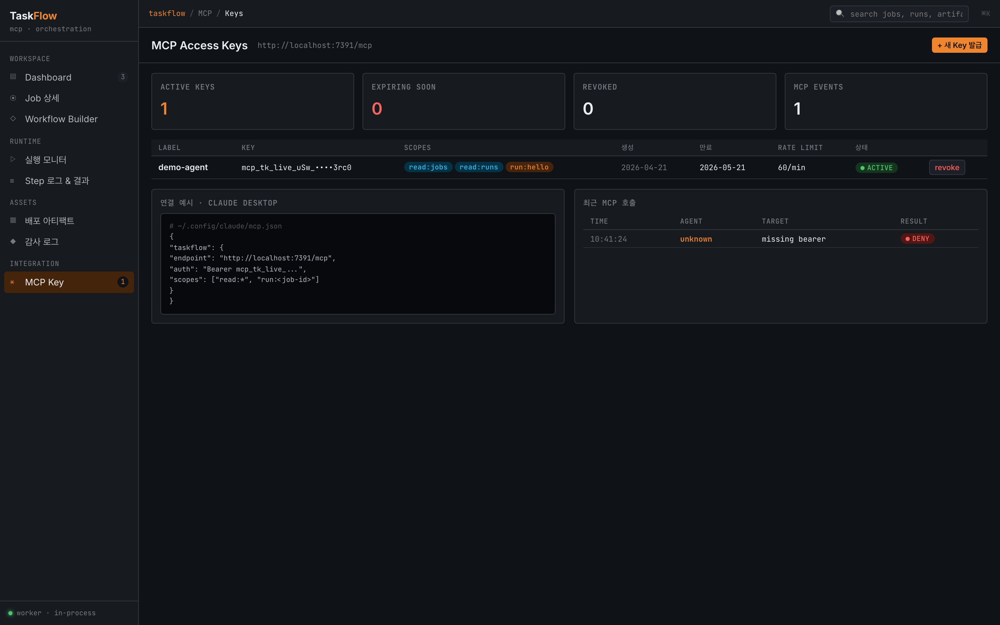

# MCP API

The TaskFlow MCP server runs on **Streamable HTTP transport**. All calls require an `Authorization: Bearer <token>` header.

- Base URL: `http://localhost:7391/mcp`
- Protocol: JSON-RPC 2.0 (`initialize` → `notifications/initialized` → `tools/call`)
- Auth: pass the MCP Key plaintext as the Bearer token

## 1. Issuing an MCP Key



### Via UI

`MCP Key` screen → `+ Issue Key` → select Label / Scope / Expiry / Rate limit. **The key is shown only once immediately after issuance** — copy it somewhere safe.

### Via CLI

```sh
curl -s -X POST http://localhost:8000/api/keys \
  -H "Content-Type: application/json" \
  -d '{
    "label": "test-agent",
    "scopes": ["read:jobs", "read:runs", "run:hello"],
    "expires_days": 30,
    "rate_limit": "60/min"
  }'
```

Example response:

```json
{
  "id": "k_...",
  "label": "test-agent",
  "plaintext": "mcp_tk_live_xxxxxxxxxxxxxxxxxxxxxxx",
  "scopes": ["read:jobs", "read:runs", "run:hello"],
  ...
}
```

The `plaintext` value is available **only at this moment**. Only a hash is stored in the DB.

## 2. Scope Rules

| Scope | Meaning |
|---|---|
| `read:jobs` / `read:runs` / `read:*` | Read-only tools only |
| `run:<job-id>` | Run a specific job |
| `run:*` | Run any job |
| `write:uploads` | Upload artifacts |

Match priority: `run:<job-id>` > `run:*` > read-only. Calling `run_job` with a read-only key returns `403 DENY` + `auth.fail` audit record.

## 3. Direct JSON-RPC Calls

```sh
TOKEN="mcp_tk_live_...(issued plaintext)..."

# 1) initialize
curl -D /tmp/hdr -X POST http://localhost:7391/mcp \
  -H "Content-Type: application/json" \
  -H "Accept: application/json, text/event-stream" \
  -H "Authorization: Bearer $TOKEN" \
  -d '{"jsonrpc":"2.0","id":1,"method":"initialize","params":{
       "protocolVersion":"2025-06-18","capabilities":{},
       "clientInfo":{"name":"curl","version":"1"}}}'

# Extract Mcp-Session-Id from response headers (required for all subsequent calls)
SESSION=$(grep -i "mcp-session-id:" /tmp/hdr | awk '{print $2}' | tr -d '\r')

# 2) initialized notification
curl -X POST http://localhost:7391/mcp \
  -H "Content-Type: application/json" \
  -H "Accept: application/json, text/event-stream" \
  -H "Authorization: Bearer $TOKEN" \
  -H "Mcp-Session-Id: $SESSION" \
  -d '{"jsonrpc":"2.0","method":"notifications/initialized","params":{}}'

# 3) list available tools
curl -X POST http://localhost:7391/mcp \
  -H "Content-Type: application/json" \
  -H "Accept: application/json, text/event-stream" \
  -H "Authorization: Bearer $TOKEN" \
  -H "Mcp-Session-Id: $SESSION" \
  -d '{"jsonrpc":"2.0","id":2,"method":"tools/list","params":{}}'

# 4) run_job (sync mode)
curl -X POST http://localhost:7391/mcp \
  -H "Content-Type: application/json" \
  -H "Accept: application/json, text/event-stream" \
  -H "Authorization: Bearer $TOKEN" \
  -H "Mcp-Session-Id: $SESSION" \
  -d '{"jsonrpc":"2.0","id":3,"method":"tools/call","params":{
       "name":"run_job",
       "arguments":{"job_id":"hello","mode":"sync"}}}'
```

`run_job(mode=sync)` blocks until the run finishes and returns the following JSON in `content[0].text`:

```json
{
  "run_id": 4821,
  "job_id": "hello",
  "status": "SUCCESS",
  "started_at": "...",
  "finished_at": "...",
  "duration_sec": 1.02,
  "steps": [
    {"id": "greet", "state": "SUCCESS", "elapsed_sec": 0.002},
    {"id": "wait",  "state": "SUCCESS", "elapsed_sec": 1.01}
  ],
  "failed_step": null,
  "err_message": null,
  "logs_uri": "taskflow://runs/4821/logs"
}
```

At the same time, `mcp.run` (src=mcp) and `job.run.done` events are recorded in the `audit` table.

## 4. Tool List

| Tool | Required Scope | Description |
|---|---|---|
| `list_jobs` | `read:jobs` | List all jobs |
| `get_job(job_id)` | `read:jobs` | Job details |
| `list_runs({job_id?, status?, limit?})` | `read:runs` | Query run history |
| `get_run(run_id)` | `read:runs` | Run status/result (agent schema) |
| `get_run_logs(run_id, step_id, {tail?})` | `read:runs` | Step log text |
| `subscribe_run(run_id, {tail?})` | `read:runs` | Recent log_bus event snapshot |
| `upload_artifact(name, version, content_base64, {ext?})` | `write:uploads` | Upload artifact (base64 encoded) |
| `get_artifact(name, version)` | `read:jobs` | Artifact status |
| `run_job(job_id, {mode, artifact_ref?, idempotency_key?})` | `run:<job_id>` | Trigger a run. `mode`: `sync` / `async` |
| `cancel_run(run_id)` | `run:<job_id>` | Cancel a running run |

## 5. Run Modes

- **`sync`** (default): Waits until the run completes and returns the agent schema. If `TASKFLOW_MCP_MAX_SYNC_SEC` (default 600s) is exceeded, returns `{run_id, status:"RUNNING", degraded_to:"async"}`
- **`async`**: Returns `{run_id}` immediately → poll with `get_run(run_id)` afterward

## 6. Idempotency

Passing an `idempotency_key` to `run_job` will **return the existing run_id** on re-invocation with the same key (backed by `Run.idempotency_key` unique index in the DB).

## 7. Claude Desktop Integration

Recent versions of Claude Desktop support HTTP MCP transport. Config file location varies by distribution:

- macOS: `~/Library/Application Support/Claude/claude_desktop_config.json`
- Linux/Windows: `~/.config/claude/mcp.json` family

```json
{
  "mcpServers": {
    "taskflow": {
      "url": "http://localhost:7391/mcp",
      "headers": {
        "Authorization": "Bearer mcp_tk_live_..."
      }
    }
  }
}
```

After restarting Claude Desktop, tools like `list_jobs` will be available in the chat.

> Some Claude Desktop distributions only support stdio transport. In that case, write a separate bridge process or connect directly using the official MCP client library (`@modelcontextprotocol/sdk`, `mcp` Python).

## Troubleshooting

For MCP-related errors, see the MCP section in [Troubleshooting](./troubleshooting.en.md).
