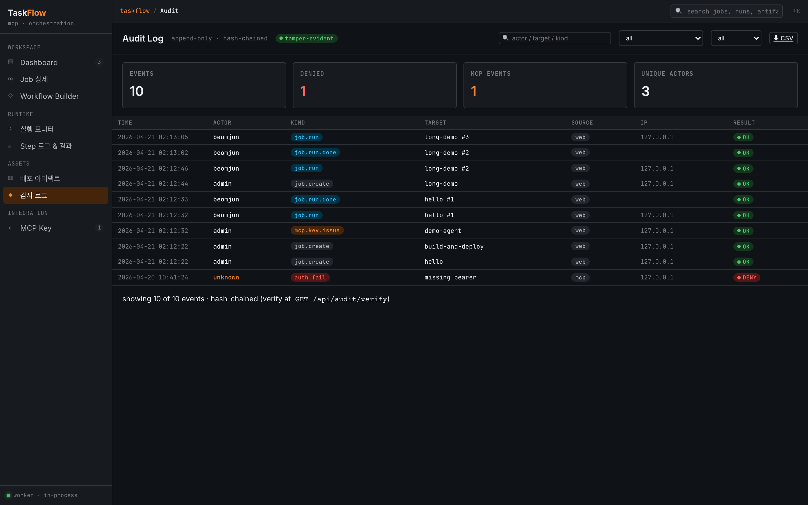

# Security Model

TaskFlow is designed with the premise that AI Agents can execute arbitrary commands, and uses **enforced policies** to prevent accidents before they happen.

## Enforced Policies

### 1. `shell=False`

Step execution is exclusively via `asyncio.create_subprocess_exec(*argv)`. There is no shell string execution path anywhere in the codebase. If argv is not a list, it is rejected at the DAG parsing stage.

### 2. argv Allowlist

Only argv prefixes listed in `backend/app/dev/allowlist.yaml` can be executed. Mismatches produce a `policy.violation` audit entry + DENY.

```yaml
allow:
  - ["echo"]
  - ["printf"]
  - ["sleep"]
  - ["ls"]
  - ["cat"]
  - ["/bin/true"]
  - ["/bin/false"]
  # + /bin/*, /usr/bin/* variants
```

To add commands:

```yaml
allow:
  - ["npm", "ci"]
  - ["npm", "run", "build"]
  - ["aws", "s3", "sync"]
```

Prefix matching: `["npm", "ci"]` allows `npm ci --silent` but denies `npm install`.

### 3. Fixed cwd

All steps run from `./storage/runtime` (default). Overridable with `TASKFLOW_STEP_CWD`, but there is no code path that sets subprocess cwd to the repo root or an arbitrary path.

### 4. Secret Environment Variable Masking

Environment variables with a `SECRET_*` prefix are:

- Masked as `***` in logs
- Recorded as a `secret.read` audit event on access

The variable name itself appears in the audit trail, but the value is never stored in the DB or logs.

### 5. Hash-chained Audit



Every audit event is linked with a `prev_hash` + `sha256(canonical_body)` chain. Modifying any single event breaks the entire chain afterward.

```sh
curl http://localhost:8000/api/audit/verify
# { "ok": true, "count": 4821 }
```

Returns `{"ok": false, "broken_at": N}` if tampering is detected. See [Troubleshooting](./troubleshooting.en.md) for response steps.

### 6. MCP Key Protection

- Only a **hash** is stored in the DB. Plaintext is included in the response only once at issuance.
- Scope matching + token bucket rate-limit (`60/min`, etc.).
- Issue / rotate / revoke all recorded as `auth.*` audit events.
- Expired keys are automatically rejected.

For scope rules, see [MCP API §2](./mcp-api.en.md#2-scope-rules).

## Why Policies Cannot Be Bypassed

- **At job creation (UI/REST)** — DAG parser validates argv format + rejects shell strings
- **At run start** — `policies.py` re-validates against the allowlist
- **At subprocess time** — `create_subprocess_exec` does not perform shell interpretation (direct execve)

Failure at any of the three points produces a `policy.violation` audit entry + run FAILED.

## Out of Scope (Currently Not Implemented)

The following are outside the current security model scope:

- Network egress control (firewall/seccomp) — delegated to OS layer
- Container/namespace isolation — process isolation is cwd-fixed level only
- SIEM forward — only local audit table (`GET /api/audit/export.csv`)
- ClamAV real integration — currently stub (upload immediately READY)

## Related

- Policy implementation details → `backend/app/engine/policies.py`, `backend/app/dev/allowlist.yaml`
- Audit event types → [02-business-rules.md](./02-business-rules.md)
- MCP Key scope matching → [MCP API](./mcp-api.en.md)
