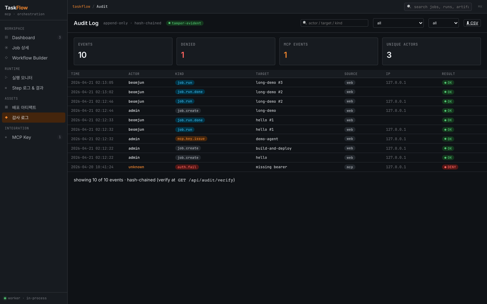

# Security Model

TaskFlow is designed with the premise that AI Agents can execute arbitrary commands. There is no restriction on which commands a step may run — **anyone who can create or edit a Job can run arbitrary commands on the server.**

> ⚠️ **The Job create/edit REST API is currently unauthenticated.** Anyone who can reach `/api/jobs` can create and run a Job, so the only real barrier is **network access control**. MCP Key scopes apply solely to the MCP surface (`run:<job-id>` to run, `read:*` to read, `write:uploads` to upload) and **do not govern Job authoring** — MCP exposes no Job-creation tool at all. Do not expose the backend on an untrusted network.

Instead of restricting which commands may run, TaskFlow narrows the execution environment with the enforced policies below and records every action in the hash-chained audit log so it can be traced after the fact.

## Enforced Policies

### 1. `shell=False`

Step execution is exclusively via `asyncio.create_subprocess_exec(*argv)`. There is no shell string execution path anywhere in the codebase — a step's `cmd` must be a non-empty list of strings (argv form), never a shell string. If argv is not a list, it is rejected at the DAG parsing stage. This blocks shell metacharacter tricks (`;`, `|`, `&&`, backticks, etc.), but it does **not** restrict which program is invoked.

### 2. Controlled cwd

Steps run from `./storage/runtime` by default. This default can be overridden with `TASKFLOW_STEP_CWD`.

If a job author needs a specific working directory for a step, use the step-level `cwd` field.

```json
{
  "id": "deploy",
  "cwd": "/opt/taskflow/apps/api",
  "cmd": ["./deploy.sh"],
  "timeout": 300
}
```

An explicit `cwd` is rejected if empty. At execution time, if it does not exist or is not a directory, the step ends as `FAILED`. `cd`, `pushd`, and `popd` cannot be used as step commands. Directory changes are shell/process state and do not carry over to later steps, so they must be represented with `cwd`.

### 3. Secret Environment Variable Masking

Environment variables with a `SECRET_*` prefix are:

- Masked as `***` in logs
- Recorded as a `secret.read` audit event on access

The variable name itself appears in the audit trail, but the value is never stored in the DB or logs.

### 4. Hash-chained Audit



Every audit event is linked with a `prev_hash` + `sha256(canonical_body)` chain. Modifying any single event breaks the entire chain afterward.

```sh
curl http://localhost:8000/api/audit/verify
# { "ok": true, "count": 4821 }
```

Returns `{"ok": false, "broken_at": N}` if tampering is detected. See [Troubleshooting](./troubleshooting.en.md) for response steps.

### 5. MCP Key Protection

- Only a **hash** is stored in the DB. Plaintext is included in the response only once at issuance.
- Scope matching + token bucket rate-limit (`60/min`, etc.).
- Issue / rotate / revoke all recorded as `auth.*` audit events.
- Expired keys are automatically rejected.

For scope rules, see [MCP API §2](./mcp-api.en.md#2-scope-rules).

## Why the Remaining Policies Cannot Be Bypassed

- **At job creation (UI/REST)** — DAG parser validates argv and `cwd` format + rejects shell strings / state-changing commands
- **At run start** — `policies.py` re-validates state-changing commands (`cd`/`pushd`/`popd`)
- **At subprocess time** — `create_subprocess_exec` does not perform shell interpretation (direct execve)

Failure at any of the three points produces a `policy.violation` audit entry + run FAILED. None of this checks *which* program is being run — only that it is expressed as argv and does not try to change directory out from under the worker.

## Out of Scope (Currently Not Implemented)

The following are outside the current security model scope:

- Network egress control (firewall/seccomp) — delegated to OS layer
- Container/namespace isolation — process isolation is currently limited to cwd control
- SIEM forward — only local audit table (`GET /api/audit/export.csv`)
- ClamAV real integration — currently stub (upload immediately READY)
- **REST API authentication** — no `/api/*` route has an auth dependency. `bootstrap.py` mints an admin session token, but nothing verifies it.
- **Dedicated low-privilege account / no-root execution** — the worker passes no `user=` or uid drop to `subprocess.Popen`. Steps run as whatever account started the backend.

## Related

- Policy implementation details → `backend/app/engine/policies.py`
- Audit event types → [02-business-rules.md](./02-business-rules.md)
- MCP Key scope matching → [MCP API](./mcp-api.en.md)
